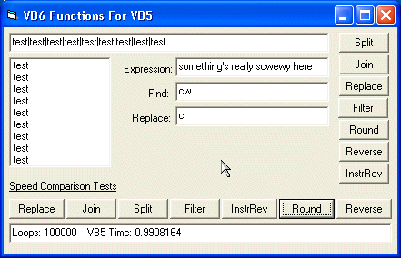



## VB6 For VB5 Replacement Functions \*Updated 11/09/03\*

### Description

*bug fixes - you will want to redownload* This is a complete and optimized vb6 for vb5 function replacement module. Functions include Round(), Split(), Join(), Replace(), Filter(), StrReverse(), and InstRev(). I code alot of examples for friends and i found no good replacement functions that didnt rely on cheap string concatenation or that even functioned like the vb6 version does. This acts and does exactly what the vb6 fucntions do, and are optimized to work as fast as possible with pure vb code, while still being complete. When converting vb6 code to vb5 you will need to turn some of your arrays for split() an Join() into variants, otherwise its a simple drop-in solution. I have fully tested all these functions but if you find any bugs let me know an ill fix them ... enjoy :) *lots of bug fixes in each function, works much better now, lots of comments added, make sure to get this again if you downloaded it before*
 
### More Info
 

             |
---                |---
**Submitted On**   |2003-11-09 14:51:56
**By**             |[Deth](https://github.com/Planet-Source-Code/PSCIndex/blob/master/ByAuthor/deth.md)
**Level**          |Intermediate
**User Rating**    |5.0 (10 globes from 2 users)
**Compatibility**  |VB 3\.0, VB 4\.0 \(32\-bit\), VB 5\.0, VB 6\.0
**Category**       |[VB function enhancement](https://github.com/Planet-Source-Code/PSCIndex/blob/master/ByCategory/vb-function-enhancement__1-25.md)
**World**          |[Visual Basic](https://github.com/Planet-Source-Code/PSCIndex/blob/master/ByWorld/visual-basic.md)
**Archive File**   |[VB6\_For\_VB1669971192003\.zip](https://github.com/Planet-Source-Code/deth-vb6-for-vb5-replacement-functions-updated-11-09-03__1-49741/archive/master.zip)

